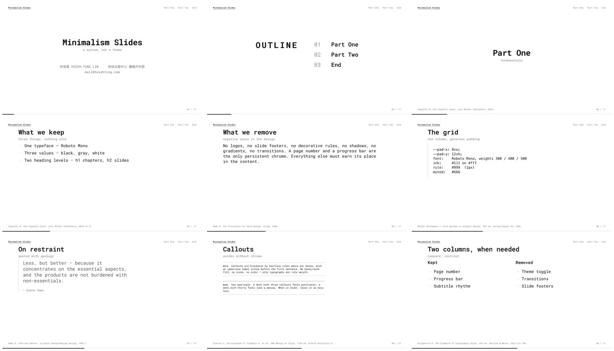

# Minimalism Slides

[](LICENSE)

A self-contained presentation deck — pure HTML, CSS, JS. No build step, no framework, no dependencies beyond Roboto Mono from Google Fonts.

**Live demo:** [slides.hsiehting.com/minimalism-slides/](https://slides.hsiehting.com/minimalism-slides/#/1)



## Open

    open index.html

Or serve over HTTP if you prefer:

    make serve            # python3 src/serve.py 8000  (routes /presenter etc.)

## Export to PDF

    make pdf              # slides.pdf via headless Chrome
    make watch            # rebuild on save (needs watchexec)
    make clean            # remove slides.pdf and dist/

The Makefile shells out to headless Chrome with `--print-to-pdf`. The PDF is rendered at `@page { size: 1920px 1080px }` (virtual 1080p screen) so every `rem`, `vh`, and `vw` resolves identically to the on-screen layout — the PDF is pixel-equivalent to a 1080p browser viewport. The reader scales the page to whatever physical paper or display you put it on later.

## Deploy to Cloudflare Pages

First-time setup — copy the example configs (which are git-tracked) into the real ones (which are git-ignored because they contain your domain):

    cp docs/slides.example.json slides.json
    cp worker/worker.example.toml worker/worker.toml
    # then edit both to point at your Cloudflare account / domain

Then:

    make dist             # bundle index.html + styles/ + src/ into dist/
    make page             # deploy dist/ to Cloudflare Pages, print live URL

`slides.json` holds both the deck identity and the deploy config:

```json
{
  "slug":        "your-slug",
  "title":       "Your Deck Title",
  "subtitle":    "a short phrase",
  "author":      "Your Name",
  "authorUrl":   "https://your-site.com/about/",
  "affiliation": "Your Institution",
  "email":       "you@example.com",
  "footer":      "Author A. Your Deck Title. Published 2026.",
  "project":     "your-pages-project",
  "domain":      "slides.yourdomain.com",
  "branch":      "main"
}
```

The identity fields (`title` through `footer`) are loaded at runtime by `slides.js` and injected into the cover slide and end-slide footer — so cloning for a new talk only requires editing `slides.json`. All fields are optional; missing ones fall back to whatever is hardcoded in `index.html`.

`make page` reads `slug` / `project` / `branch` and runs:

    wrangler pages deploy dist --project-name=$PROJECT --branch=$BRANCH

then prints the path-prefixed URL `https://$DOMAIN/$SLUG/`. (`make page` also auto-creates the Pages project if it doesn't exist yet.)

Path routing — `slides.hsiehting.com/<slug>` → `<slug>.pages.dev` — is handled by a separate Cloudflare Worker (see `worker/worker.js`):

    make worker           # wrangler deploy --config worker/worker.toml

One-time after the first `make worker`: in the Cloudflare dashboard, attach the route `slides.hsiehting.com/*` to the `slides-router` worker (Workers & Pages → slides-router → Triggers → Routes). Or uncomment the `[[routes]]` block in `worker/worker.toml` and re-run `make worker`.

Prerequisites: `jq`, `wrangler` (`npm i -g wrangler`), and either `wrangler login` or a `CLOUDFLARE_API_TOKEN` env var.

## Live mode (real-time multi-screen)

Three role-based routes on top of the same deck, powered by a single Cloudflare Durable Object per slug:

| Route | Auth | Purpose |
|---|---|---|
| `/<slug>/live` | none | Audience / projector screen. Follows DO state. Read-only. |
| `/<slug>/presenter` | PIN | Speaker laptop. Full deck + keyboard nav. Every move broadcasts to `/live` and `/control`. |
| `/<slug>/control` | PIN (same one) | Phone-in-pocket remote. `←  N/total  →` UI. |

Standalone `/<slug>/` is unchanged — opens without WebSocket and behaves as before.

### One-time setup

    wrangler secret put SLIDES_PIN --config worker/worker.toml   # enter your PIN
    make worker                                            # deploy Worker + DO + migration
    make page                                              # deploy frontend

The PIN is a single shared secret across every deck on this Worker. Same PIN unlocks presenter and control on any slug.

### Running a session

1. Open `/<slug>/live` on the projector (no PIN, no prompt — just the deck).
2. Open `/<slug>/presenter` on your laptop. Enter the PIN once (cached in `sessionStorage` for the tab).
3. Press arrow keys — the live screen advances in real time. Optionally open `/<slug>/control` on your phone for a one-handed clicker.

Multiple `/live` viewers can connect — they all see the same slide. State persists in DO storage across reconnects and DO hibernation.

### Presenter view (extra chrome)

`/<slug>/presenter` splits the screen 60/40:

- **Left 60vw:** the actual deck — same layout, type, and auto-fit as `/live`.
- **Right 40vw:** the presenter pane:
  - **Timer** at the top — counts up from your first nav action, reset with the `R` key or the on-screen button. Target defaults to **25:00**; edit the target in presenter view to save a local browser default. Once you exceed it, the timer block inverts (white-on-black) until you reset.
  - **Next slide preview** — a live mini-render of the upcoming `<section>`, scaled via CSS transform. Updates automatically on every state change.
  - **Speaker notes** — pulled from the current section's `<aside class="notes">…</aside>` (if present). Notes are hidden globally and only shown here.

To add speaker notes to a slide, drop an `<aside class="notes">` inside the `<section>`:

```html
<section>
  <h2>What we keep</h2>
  <h6>three things, nothing else</h6>
  <ul>...</ul>
  <aside class="notes">
    Three things, not three rules. Don't dwell — the next slide flips
    to "what we remove" and that's where the contrast lands.
  </aside>
  <footer>Citation.</footer>
</section>
```

The `<aside class="notes">` element never renders on standalone, live, or control — only in the presenter pane.

## Controls

| Keys                       | Action                |
| -------------------------- | --------------------- |
| → ↓ PgDn Space             | Next slide            |
| ← ↑ PgUp Shift+Space       | Previous slide        |
| Home / End                 | First / last slide    |
| o / Esc                    | Toggle overview grid  |
| Cmd/Ctrl + P               | Print, one per page   |

Touch: swipe left / right on mobile. The URL hash (`#/3`) reflects the current slide and is restored on reload.

## Authoring

Each slide is one `<section>` inside `<main id="deck">`. Read **`.claude/skills/slides-design/SKILL.md`** for the full layout catalog, decision tree, and density limits before adding new slides.

Quick conventions:

- `<h1>` — chapter divider, centered. Also feeds the auto-generated chapter menu and outline page.
- `<h2>` — standard content slide, left-aligned.
- `<h3>` — sub-section. Auto-prepends the closest preceding `<h2>` within the same chapter as a `Parent · Title` breadcrumb.
- `<h5>` — column title inside `<div class="cols">`.
- `<h6>` after a heading — subtitle (gray). If you omit it, JS injects an empty `<h6>` to preserve vertical rhythm.
- `<footer>` inside a section — per-slide AMA-style citation, bottom-left.

Available section classes:

- `<section class="outline"></section>` — auto-populated outline page (place it second, JS replaces its contents with a numbered list of every `<h1>` after the cover).
- `<section class="pic-caption">` — text-left + figure-right two-column layout.

Components inside slides: `<p>`, `<ul>`, `<ol>`, `<dl>`, `<pre><code>`, `<blockquote><cite>`, `<aside class="callout">` / `.callout.warn`, `<table>` (with `.num` for right-aligned numeric columns), `<div class="cols">`.

To add a slide, drop a new `<section>` into `index.html`. No registration step.

## Design rules

- Type: [Roboto Mono](https://fonts.google.com/specimen/Roboto+Mono), weights 300 / 400 / 500 / 600 / 700.
- Colors: `#fff`, `#111`, `#666`, `#999`. Nothing else.
- Master scale: `html { font-size: max(28px, 3.6vmin) }`. Every other size in `rem` or `em` so the whole deck scales from this one knob.
- Progress bar: 5px, bottom edge, black fill on a hairline rule.
- Page number: `03 / 17`, bottom-right, muted gray.
- Auto-fit: body content shrinks per slide via `--body-scale` (floor 0.4) so dense slides stay above the citation footer. Runs on load, resize, and `beforeprint`/`afterprint`.

## Files

    index.html         markup — one <section> per slide
    styles/            base.css, slides.css, chrome.css, overview.css,
                       presenter.css, control.css, print.css
    src/
      slides.js        mode dispatcher (standalone / live / presenter / control)
      core.js          shared deck setup + rendering (auto-fit, chapter menu, outline)
      serve.py         dev server with /presenter /live /control fallback routing
    docs/
      preview.png      3×3 thumbnail grid (regenerate via `make preview`)
      slides.example.json    template — copy to ../slides.json before deploying
      GOTCHAS.md       hard-won lessons from earlier iterations
    worker/
      worker.js              Cloudflare Worker — path router for your apex
      worker.example.toml    template — copy to worker.toml before deploying
      worker.toml            (gitignored) actual wrangler config
    slides.json        (gitignored) actual deploy config
    Makefile           make pdf / serve / watch / dist / page / worker / preview / clean
    CLAUDE.md          directs future Claude sessions to the design skill
    .claude/skills/
      slides-design/
        SKILL.md       full layout catalog, sizing reference, anti-patterns
    .gitignore         excludes .DS_Store, *.pdf, dist/, .wrangler/

## License

MIT — see [LICENSE](LICENSE).
